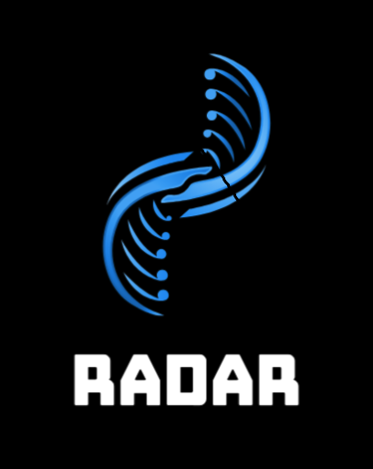
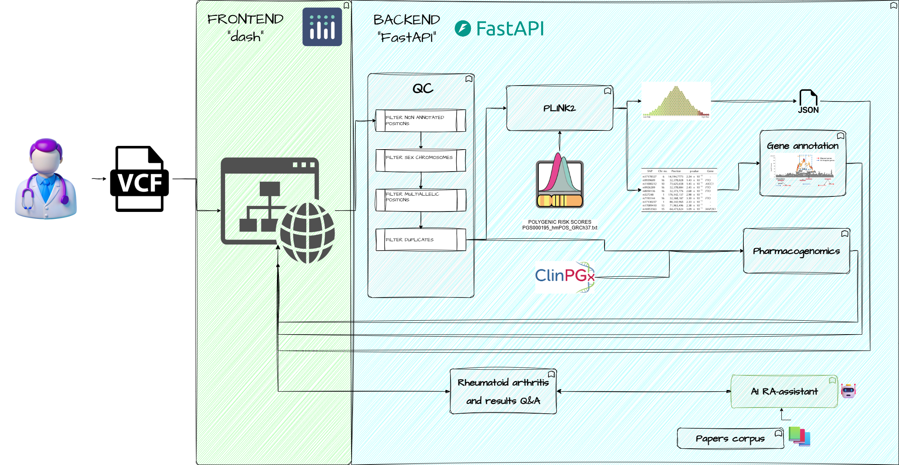

<h1>
  
  RAdar: SNP2Risk for Rheumatoid Arthritis
</h1>
# RAdar: SNP2Risk for Rheumatoid Arthritis

🧬 **An accessible web-based tool that calculates personalized genetic risk scores for rheumatoid arthritis (RA)**

## What is RAdar?

RAdar helps you understand your genetic predisposition to rheumatoid arthritis by analyzing your DNA sequencing data. Simply upload your genetic raw data file (VCF format) from popular direct-to-consumer genetic testing services like Genotek and get a personalized Polygenic Risk Score (PRS).

### What is a Polygenic Risk Score?
A Polygenic Risk Score combines information from multiple genetic variants to estimate your genetic risk for developing rheumatoid arthritis compared to the general population. **Important**: This is for educational purposes only and should not replace professional medical advice.


## 📊 Repository Structure

This repository contains:

1. **Web application**: A Dash-based web application - frontend/
2. **RA Polygenic Risk Score Pipeline**: Core analysis pipeline for VCF processing - backend/ and src/
3. **AI Assistant**: Based on Qwen3



## 🚀 Quick Start

### Prerequisites
- Your genetic raw data file in VCF format (example VCF file provided in input/vcf folder)
- Docker installed on your system
- Basic familiarity with command line tools

## 📋 How to Use

This repository contains two main components:
1. **A service platform**
2. **RA Polygenic Risk Score Pipeline** - A pipeline for processing VCF files and calculating polygenic risk scores

## Running the Web Application Locally

You can run the web application locally using Docker. This will allow you to leverage all features of RAdar through a web-based interface.

### Steps to Launch the Web Application
1. Ensure you have Docker and Docker Compose installed on your system.
2. Navigate to the root directory of this repository in your terminal.
3. Run the following command to build and start the application:

```bash
docker-compose up --build
```

4. Once the application is running, access it in your web browser at `http://localhost:9002`.

## ✨ Features & Functionality

RAdar’s web application offers a user-friendly experience with the following key features:

### 📈 Interactive Reports with Visualizations

- **Personalized Risk Dashboard:** After uploading your VCF file, receive a comprehensive report summarizing your Polygenic Risk Score (PRS) for rheumatoid arthritis and key mutations.
- **Data Visualizations:** The report includes a variety of easy-to-understand plots and charts, such as:
  - Your PRS compared to the general population
  - Distribution of risk alleles and detailed info on them
  - Contribution of top 10  most unfluential individual genetic variants to your score
  - Identified mutations that affect drug toxicity and efficacy
  - Visualized gennomic regions of the most important mutations
- **Downloadable Results:** Export results in a PDF report for sharing or future reference.

### 🤖 AI-Based Results Assistant

- **Integrated AI Assistant:** Leverage an AI-powered assistant built into the web app to help interpret your results.
  - Ask questions about your PRS, what it means, and how to understand the genetic factors involved, key genes, proteins and mutations.

These features make RAdar not only a powerful analytics platform but also an accessible educational tool for users seeking to understand their genetic risk for rheumatoid arthritis.

## ⚠️ Important Disclaimers

- **Not for medical diagnosis**: Results are for research and educational purposes only
- **Consult healthcare providers**: Always discuss genetic risk with qualified medical professionals
- **Population specificity**: Risk scores may vary by ancestry and population
- **Privacy**: Your genetic data is processed locally and not stored permanently. Security is ensured through a JWT token given to each user upon session initialization. 

## 🆘 Support

If you encounter issues:
1. Check error details
2. Ensure your VCF file format is correct
3. Verify your genome build matches GRCh37
4. Open an issue in this repository
5. Contact support via Telegram: @mkkoshkina

## 📚 Learn More

- [Understanding Polygenic Risk Scores](https://www.nature.com/articles/s41596-020-0353-1)
- [Rheumatoid Arthritis](https://www.mayoclinic.org/diseases-conditions/rheumatoid-arthritis/symptoms-causes/syc-20353648)
- [VCF File Format Guide](https://www.ebi.ac.uk/training/online/courses/human-genetic-variation-introduction/variant-identification-and-analysis/understanding-vcf-format/)

---

## Command-line Usage For Advanced Users

You can also interact with the service using command-line tools like `curl`.

### Health Check

Check if the service is running:

```bash
curl http://localhost:5000/health
```

### Predict Endpoint

Submit a POST request to `/predict` with a JSON payload specifying your VCF file and (optionally) whether to clean temporary files.

**Example using `curl`:**

```bash
curl -X POST http://localhost:5000/predict \
  -H "Content-Type: application/json" \
  -d '{
    "vcf_file": "input/vcf/sample.vcf",
    "clean_tmp": true
  }'
```

- `vcf_file`: Path to your VCF file, relative to the `/input` directory inside the container (e.g., `vcf/sample.vcf`).
- `clean_tmp`: (Optional) Boolean, whether to clean up temporary files after processing (default: `true`).

**Note:**  
The assembly is currently set to `'GRCh37'` by default in the API code. `'GRCh38'` is in progress.

### Output

The API will return a JSON response with the results or an error message:

```json
{"log_file":"log/lm5515.log","output_json":"output/lm5515.json","status":"success","table_snps_used":"output/final_prs_table.tsv"}
```

### System Requirements
- Docker
- Minimum 4GB RAM
- 2GB free disk space

**Made with ❤️ for advancing personalized medicine research**
